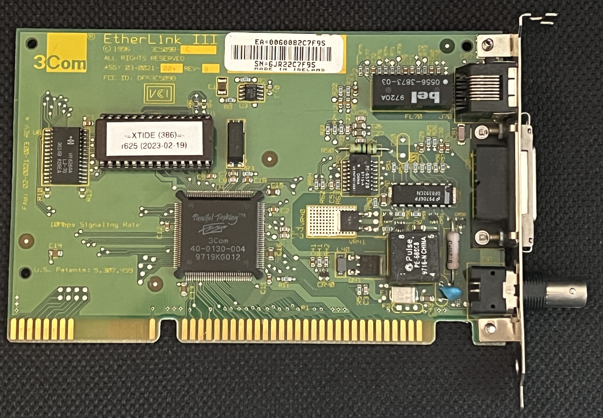

# Project 386DX40

## Hardware

| image                                                                                                                                                                                                                                     | description                                                                                                                                                                                                                                                                                                                                                                                                                                                                                                                                                                                                                                                                                                                                                      |
|:------------------------------------------------------------------------------------------------------------------------------------------------------------------------------------------------------------------------------------------|:-----------------------------------------------------------------------------------------------------------------------------------------------------------------------------------------------------------------------------------------------------------------------------------------------------------------------------------------------------------------------------------------------------------------------------------------------------------------------------------------------------------------------------------------------------------------------------------------------------------------------------------------------------------------------------------------------------------------------------------------------------------------|
|                                                                                                                                                                      | The&nbsp;mainboard&nbsp;is&nbsp;a&nbsp;[TK&nbsp;TK-82C491/386-4N-D02C](https://theretroweb.com/motherboards/s/tk-tk-82c491-386-4n-d02c) which is a clone of an [ABIT AB AK-3](https://theretroweb.com/motherboards/s/abit-ab-ak3)  <b>Chipset:</b>&nbsp;UMC&nbsp;UM82C491 <b>Socket:</b>&nbsp;PQFP132 <b>FSB:</b> 40MHz <b>Cache:</b> 128KB <b>RAM:</b> 8x 1mb 30-pin SIMM <b>Dimensions:</b> Baby AT (170mm x 220mm) <b>Jumper Settings:</b> [mainboard-jumper.pdf](./ressources/mainboard-jumper.pdf)                                                                                                                                                                                                                      |
|                                                                                                                                                                | Holtek&nbsp;Microelectronics&nbsp;Inc&nbsp;Multi&nbsp;I/O&nbsp;Card&nbsp;SIO2A. Providing 2 COM Ports + 1 Parallel Port, Floppy Controller IDE Controller                                                                                                                                                                                                                                                                                                                                                                                                                                                                                                                                                                                                        |
|                                                                                                                                                                        | the graphics card is a Realtek RTG3106 with 1mb RAM  <b>Jumper Settings</b>  <b>JP1</b> (VGA FEATURE CONNECTOR POWER CONFIGURATION) M12 & M13 connect to Vcc. (Ground) Closed M12 & M13 floating (Open) Open  <b>JP2</b> (BASE ADDRESS DECODING CONFIGURATION) Unlatched (Fast) Open Latched (Slow) Closed  <b>JP3</b> (VGA GRAPHICS MODE CONFIGURATION) Interlaced Open  Non-interlaced Closed  <b>JP4</b> (not installed, BUS SIZE DETECTION CONFIGURATION) Auto detect Closed 8-bit Open  <b>JP5</b> (INTERRUPT SELECTION) 2/9 Pins 1 & 2 Closed 7 Pins 2 & 3 Closed ? no interrupt Open ?  VESA 2.0 compliance via [UNIVBE 6.7](./ressources/scitech.7z) |
|                                                                                                                                                                    | Set to Interrupt 10 Address 300 via [3com EtherDisk](./ressources/3Com%20EtherDisk%20v5.0.img)                                                                                                                                                                                                                                                                                                                                                                                                                                                                                                                                                                                                                                                                   |
|                                                                                                                                                                          | SET BLASTER=A220 I5 D1 H3 T4  C:\UNISOUND\UNISOUND.COM /VC80 /VL80 /VF60  [Unisound 0.80a](./ressources/UNISOUND080a.zip)                                                                                                                                                                                                                                                                                                                                                                                                                                                                                                                                                                                                                            |
|        | BIOS Settings for cf card (autodetected by different pc bios) cylinders: 987 heads 16 sectors 63 precomp 65535 lzone 986                                                                                                                                                                                                                                                                                                                                                                                                                                                                                                                                                                                                                     |
|        |                                                                                                                                                                                                                                                                                                                                                                                                                                                                                                                                                                                                                                                                                                                                                                  |
|                                                                                                                                                                    |                                                                                                                                                                                                                                                                                                                                                                                                                                                                                                                                                                                                                                                                                                                                                                  |

## Interrupts, I/O, DMA
as this is not a plug and play system this is to keep track
### Interrupts
| IRQ | usage                                |
|----:|--------------------------------------|
|   0 | Timer                                |
|   1 | Keyboard                             |
|   2 | Connects to IRQ 9                    |
|   3 | COM2                                 |
|   4 | COM1                                 |
|   5 | Orpheus I (SB Pro) via unisound      |
|   6 | Floppy                               |
|   7 | LPT1                                 |
|   8 | Real-time clock                      |
|   9 | Orpheus I (MPU) via unisound         |
|  10 | 3COM network card via config program |
|  11 |                                      |
|  12 |                                      |
|  13 | Math coprocessor                     |
|  14 | IDE Controller                       |
|  15 |                                      |

### I/O
| I/O Address | Usage                  |
|-------------|------------------------|
| 1F0h        | Primary IDE interface  |
| 200h        | Orpheus I (JOY)        |
| 220h        | Orpheus I (ADD SB Pro) |
| 2F8h        | COM2 with IRQ3         |
| 300h        | 3Com network adapter   |
| 330h        | Orpheus I (MPU)        |
| 378h        | LPT1 with IRQ7         |
| 388h        | Orpheus I (OPL)        |
| 3F8h        | COM1 with IRQ4         |
| 534h        | Orpheus I (WSS)        | 

### DMA
| DMA | Usage              |
|-----|--------------------|
| 1   | Orpheus I (SB Pro) |
| 3   | Orpheus I (WSS)    | 

## System setup
after everything is assembled stuff gets installed via 3.5" floppy disks, creating real disks from images can be performed by another old pc or by using some specialized hardware like a [Greaseweazle](https://github.com/keirf/greaseweazle)

### Operating System MS DOS 6.22
https://winworldpc.com/product/ms-dos/622

