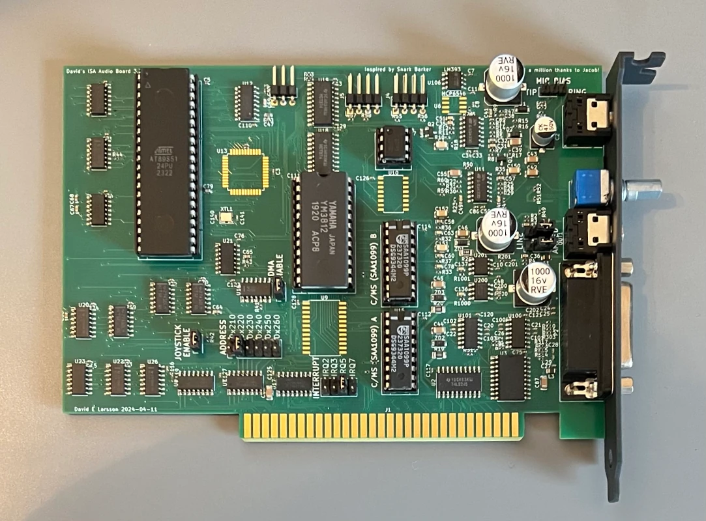
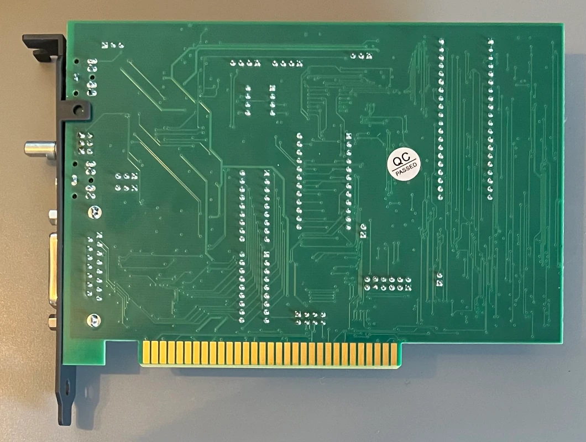
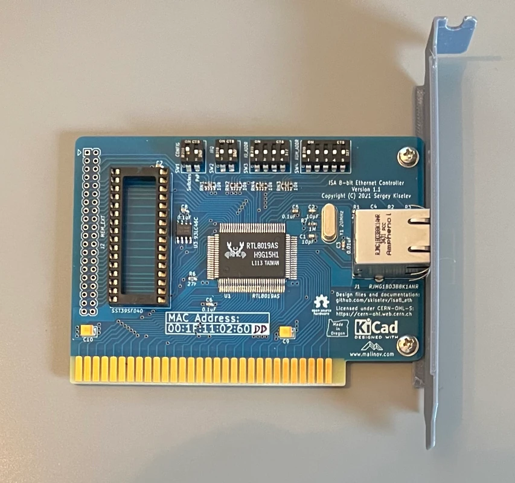
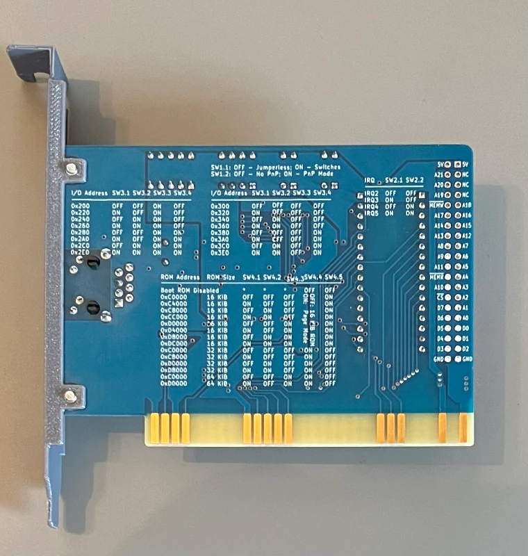
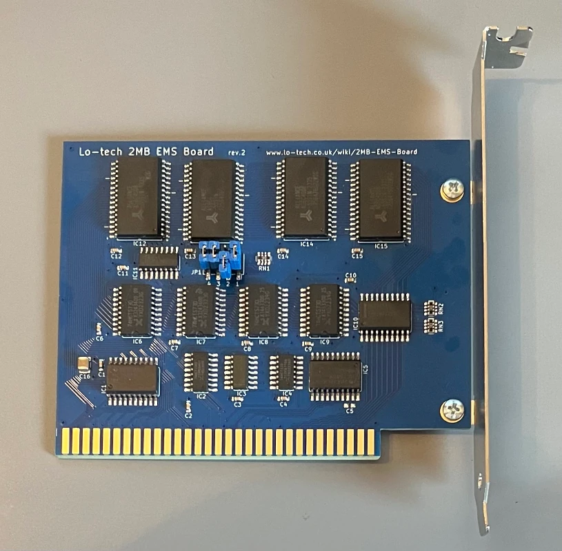
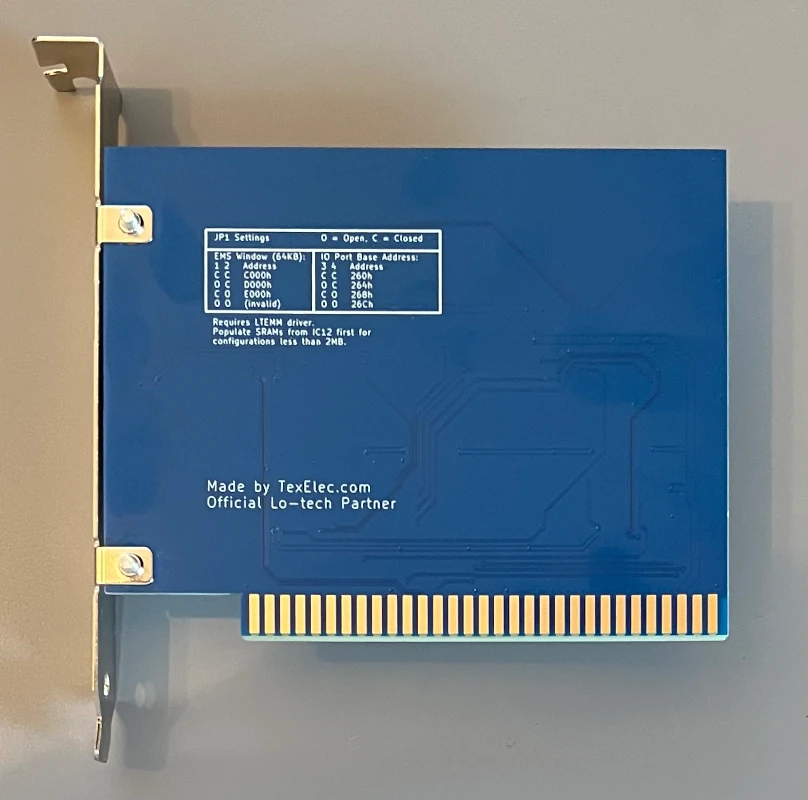

# Turbo PC XT Clone, Christmas 2024 :)
Collecting all the information about my build in one place for future reference. 

I want to build a PC system comparable to a PC XT, using an 8088 CPU, or as in this case a NEC V20 which has some speed improvements 
and also is able to not only execute 8086 but also 80186 machine code, yay! Which hopefully helps to get speedier IDE access 
and a working parallel port zip drive using iomega drivers.

As I don't want to fight dying 40 year old hardware and have some convenience I chose a Monotech NUXT 2.0 mainboard which
already includes a lot of the features needed. For example usage of ps/2 style keyboard + mouse that get translated to a
xt keyboard and a serial mouse. also a VGA card and a XT-IDE is integrated.

Things I want to do? generally explore the machine and its (in) abilities :P . Play games and try some programming in assembler and C.

## Hardware
### NUXT 2.0

### 8-bit ISA Sound Blaster 1.5 clone with C/MS
As Soundcard I chose a 8bit Soundblaster 1.5 Clone. Designed by [David's electronics](https://electronics.dose.se) in Sweden.
I bought the card on [tindie.com](https://www.tindie.com/products/kdehl/8-bit-isa-sound-blaster-15-clone-with-cms/)

#### Features of the card
- Adlib (OPL2)
- Sound Blaster sampled audio 
- MIDI, through the usage of a Joystick-to-MIDI adapter 
- CMS (SAA1099) Game Blaster chips installed 

#### Drivers
this soundcard should generally work without any drivers loaded. nevertheless there is some software
extract the [sb.zip](./res/sb.zip) to C:\SB and SET SOUND in AUTOEXEC.BAT accordingly.

The drivers are copied from [philscomputerlab.com](https://www.philscomputerlab.com/sound-blaster-15.html)

#### Images
|  |   |
|---------------------------------------------------|--------------------------------------------------|

### 8-bit ISA Ethernet Controller
As Network card i chose and 8 bit ISA RTL8019 that is NE2000 compatible. Designed by [Weird Electronics](https://www.tindie.com/stores/weird/#store-section-about) in USA.
I also bought this card on [tindie.com](https://www.tindie.com/products/weird/isa-8-bit-ethernet-controller/)

#### Features of the card
- NE2000 compatible nic (provides own 8bit adjusted packet driver)

#### Website and drivers
- https://github.com/skiselev/isa8_eth

#### Images
|  |  |
|----------------------------------------|--------------------------------------|

### 8-bit ISA Lo-tech EMS 2MB
To expand the memory of the PC XT I chose a Lo-Tech 2MB EMS card. This card I purchased at [texelec.com](https://texelec.com/product/lo-tech-ems-2-mb)

#### Features of the card
- 2MB memory accessible as EMS 

#### Drivers
- Extract [Drivers](./res/2MB-EMS.zip) to a directory and load at startup (see CONFIG.SYS), also the UMB Config and EMS Card config has to match


#### Images
|  |  |
|-----------------------------------------------------|---------------------------------------------------|

## Ressource Assignments

### IRQ
Integrated XT-IDE and EMS Card do not require an IRQ

| IRQ | DEVICE                 |
|-----|------------------------|
| 0   | System Timer           |
| 1   | Keyboard Controller    |
| 2   | Network Card           |
| 3   | Serial Port 2 (COM2)   |
| 4   | Serial Port 1 (COM1)   |
| 5   | Soundblaster 1.5       |
| 6   | Floppy Controller      |
| 7   | Parallel Port 1 (LPT1) |

### DMA
| DMA | DEVICE           |
|-----|------------------|
| 1   | Soundblaster 1.5 |

### Address
| I/O  | DEVICE                      |
|------|-----------------------------|
| 070h | RTC                         |
| 170h | XT-ID                       |
| 200h | Soundblaster 1.5 (Gameport) |
| 220h | Soundblaster 1.5            |
| 260h | EMS Card                    |
| 2F8h | Serial Port 2 (COM2)        |
| 300h | Network Card                |
| 378h | Parallel Port 1 (LPT1)      |
| 3F8h | Serial Port 1 (COM1)        |

### Memory Layout
| Memory Range | Usage                                                                                 |
|--------------|---------------------------------------------------------------------------------------|
| FC00-FFFF    | System BIOS                                                                           |
| F400-FBFF    | 32kb Free Space in ROM                                                                |
| F000-F3FF    | XT IDE BIOS                                                                           |
| E000-EFFF    | 64kb EMS Window (UMB Switch 5, 6 OFF)                                                 |
| D000-DFFF    | 64kb useable as UMB (UMB Switch 3, 4 ON)                                              |
| C800-CFFF    | 32kb useable as UMB (UMB Switch 2 ON)                                                 |
| C000-C7FF    | 32kb EGA/VGA Bios (UMB Switch 1 OFF)                                                  |
| B800-BFFF    | 32kb CGA Video RAM 16kb (the entire 32k is filled with repeats of the first 16k area) |
| B000-B7FF    | 32kb MDA Video RAM  4kb (the entire 32k is filled with repeats of the first  4k area) |
| A000-AFFF    | 64kb EGA Video RAM                                                                    |

NUXT 2.0 is not mapping RAM between A000-BFFF, these areas can not be used for UMB

## Configuration
### NUXT 2.0
#### Hardware switches
For details about other switch positions see the NUXT 2.0 manual.

##### SW1: System Config
| Switch | Setting | Description                                                                        |
|--------|---------|------------------------------------------------------------------------------------|
| 1      | **ON**  | **Enabled for VGA**                                                                |
| 2      | **ON**  | **Enabled for VGA**                                                                |
| 3      | OFF     | Disabled keyboard E0 scancode passthrough for the AT to XT                         |
| 4      | **ON**  | **Enable onboard RAM**                                                             |
| 5      | OFF     | First part of the ROM is used as the NEC V20 has 80186 instructions, faster XT-IDE |
| 6      | **ON**  | **Enable onboard floppy controller**                                               |
| 7      | **ON**  | **Enable onboard ide controller**                                                  |
| 8      | **ON**  | **CF-Card ist IDE-Master**                                                         |


##### SW2: Upper Memory Blocks Config
RAM can be mapped in 32kb chunks to the following locations

| Switch | Setting | Description                                  |
|--------|---------|----------------------------------------------|
| 1      | OFF     | C0000-C8000 (VGA BIOS uses this memory area) |
| 2      | **ON**  | **C8000-D0000** (used as UMB)                |
| 3      | **ON**  | **D0000-D8000** (used as UMB)                |
| 4      | **ON**  | **D8000-E0000** (used as UMB)                |
| 5      | OFF     | E0000-E8000 (EMS card uses this memory area) |
| 6      | OFF     | E8000-F0000 (EMS card uses this memory area) |

This Configuration creates 96kb of UMB (C8000-DFFFF) useable by USE!UMBS.SYS 

##### SW3: UART Config set to COM1
| Switch | Setting | Description      |
|--------|---------|------------------|
| 1      | **ON**  | **IRQ 4**        |
| 2      | OFF     | IRQ 3            |
| 3      | **ON**  | **address 3F8h** |
| 4      | OFF     | address 2F8h     |
| 5      | OFF     | address 3E8h     |
| 6      | OFF     | address 2E8h     |

##### SW4: UART Config set to COM2 (PS/2 Mouse Port connected to this)
| Switch | Setting | Description      |
|--------|---------|------------------|
| 1      | OFF     | IRQ 4            |
| 2      | **ON**  | **IRQ 3**        |
| 3      | OFF     | address 3F8h     |
| 4      | **ON**  | **address 2F8h** |
| 5      | OFF     | address 3E8h     |
| 6      | OFF     | address 2E8h     |

##### SW5: Parallel Port Config
| Switch | Setting | Description      |
|--------|---------|------------------|
| 1      | **ON**  | **IRQ 7**        |
| 2      | OFF     | IRQ 5            |
| 3      | **ON**  | **address 378h** |
| 4      | OFF     | address 278h     |

#### BIOS
to enter the BIOS Setup, press F1 then Esc during the RAM test or Video BIOS splash.
1. 'C' 9 Set Startup Speed to 9.55 Mhz
2. 'F' 4 Set first Floppy to 1.44M 3 1/2"
3. 'D' set RTC time

### MS-DOS 6.22

#### Drivers

##### NANSI.SYS
A fast (and smaller) replacement for ANSI.SYS, part of Freedos
- https://www.ibiblio.org/pub/micro/pc-stuff/freedos/files/dos/nansi/4.0d/nansi40d.zip
- Local copy in this Repo [nansi40d.zip](./res/nansi40d.zip) 

##### KBD.COM
Microsofts Keyboard.sys (keyb gr) is for some reason mapping a lot of stuff not at all or wrong. A smaller and better alternative at least for german keyboard layout is KBD.COM . Every key (if know to an XT) is mapped at the right place. It took me a while to understand that XT keyboards do not know ALTGR, instead CTRL + ALT can be used when ALTGR is needed.

- Downloaded from the now defunct page [helmrohr.de](http://www.helmrohr.de/ftproot/Kbd.zip)
- [Archive.org provides a copy](https://web.archive.org/web/20140904180200/http://www.helmrohr.de/ftproot/Kbd.zip)
- Local copy in this Repo [KBD.ZIP](./res/Kbd.zip) 

##### CTMOUSE
Monotech endorsed the use of microsofts mouse driver. I had no problems so far using ctmouse 1.9
https://cutemouse.sourceforge.net

#### Config Files

##### AUTOEXEC.BAT
```
@ECHO OFF
PROMPT $P$G
PATH C:\DOS;C:\UTILS\NC;C:\UTILS\NU
SET TEMP=C:\TEMP
SET TMP=C:\TEMP

:: Sound Setup
SET BLASTER=A220 I5 D1 T1
SET SOUND=C:\SB

:: Network Setup
:: TZ used by sntp.exe -set 192.168.2.1
:: SOMMERZEIT UTC-2:00, WINTERZEIT UTC-1:00
SET TZ=UTC-1:00
SET MTCPCFG=C:\UTILS\MTCP\CONFIG\MTCP.CFG
LH C:\UTILS\NE2000\NE2000.COM 0x60 2 0x300
C:\UTILS\MTCP\DHCP.EXE

```

##### CONFIG.SYS
```
FILES=30
BUFFERS=20
FCBS=1
STACKS=9,256
REM No HIGH memory on PC XT, but this triggers DOSMAX
DOS=UMB,HIGH

REM For USE!UMBS E000 is expanded to E0000 then -1, so C8000-DFFFF is used
DEVICE=C:\UTILS\USE!UMBS\USE!UMBS.SYS C800-E000

DEVICEHIGH=C:\UTILS\LTEMM\LTEMM.EXE /p:E000 /i:260
DEVICEHIGH=C:\UTILS\DOSMAX\DOSMAX.EXE /R- /N+ /P-
DEVICEHIGH=C:\DOS\SETVER.EXE
SHELL=C:\UTILS\DOSMAX\SHELLMAX.COM /R- C:\COMMAND.COM C:\ /E:256 /P
```

##### MTCP.CFG
todo

##### FTPPASS.CFG
todo

