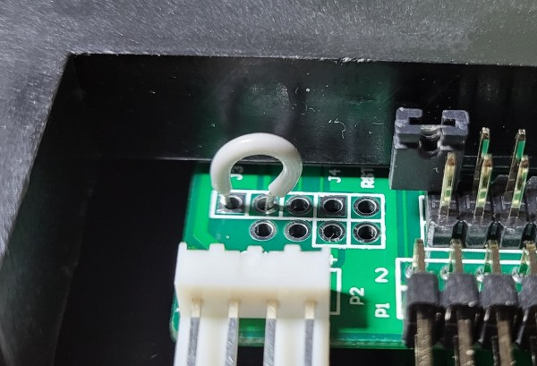

# Flasing a gotek floppy emulator with flashfloppy via usb

perforn this as root:

1. install dfu-util

```bash
$ emerge dfu-util
```
2. [download the flashfloppy release](https://github.com/keirf/flashfloppy/releases) and unpack it. There will be a dfu/ directory containing the firmware file. You want to use the .dfu file, not the .hex file.
3. set the programming jumper on the gotek as per wiki
     
4. attach gotek to linux box via usb-a to usb-a cable
5. ```bash dfu-util --list``` This should display two entries for one device (just different alt numbers). If more than one device is shown, you'll have to add the --device option as per the dfu-util manpage
6. ```bash dfu-util -D /path/to/flashfloppy-at415-st105-3.36.dfu -a 0 -s 0x08000000:unprotect:force ``` # this will fail with an error, but will unprotect the internal flash in the process
7. ```bash dfu-util -D /path/to/flashfloppy-at415-st105-3.36.dfu -a 0 ``` # Now that the flash is unlocked, the device will be programmed. NOTE: if this step fails with "dfu-util: ERASE_PAGE not correctly executed" repeat step 6 and then this step again
8. unplug usb cable. Move programming jumper back to non-programming position. Apply 5v to appropriate berg header pins. 7-segment display should read "F-F" if the programming was successful
