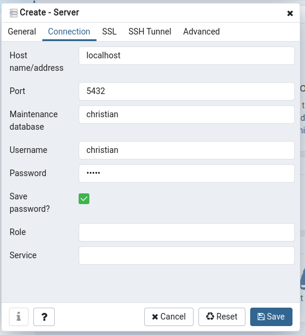

# Postgresql
[Homepage](https://www.postgresql.org/ "PostgreSQL Homepage")
## [Versionsschema](https://www.postgresql.org/support/versioning/ "Versionsschema")

x.y.z

* z - Security und andere Patches ... Upgrade kein Ding

* y - major upgrade, neue features aber kompatibel

* x - Architekturänderungen ... hier kann es knallen ... nicht einfach so aktualisieren.

Vereinfachung der Versionierung
"sozusagen" xy.z seit der 10.

es wird nicht mehr zwischen breaking change und feature release unterschieden.

Jedes Jahr gibt es ein Major Release, das dann 5 Jahre unterstützt wird.

## Lizensierung
DB ansich ist BSD lizensiert.

## Dokumentation
[Online Dokumentation](https://www.postgresql.org/docs/12/index.html "Postgres Docs")
## Anlegen von Benutzern
Das Konzept Benutzer hat sich bei Postges. Man legt alles und jeden als Rollen an die dann unteranender erben.
Rolle -> Rolle
Gruppe -> Rolle
User -> Rolle 

## [Datentypen](https://www.postgresql.org/docs/12/datatype.html "Datentypen")
- INTEGER 4 byte
- BIGINT 8 byte
- SMALLINT 2 byte
- Serial INTEGER -> nextval('sequence')
- Bigserial ...
- numeric (x,y) -> x Anzahl Stellen y wieviele davon sind nch dem Komma
boolean
- char(n) 
    > n Anzahl der Zeichen. char ist langsamer als varchar wegen auffüllen mit leerzeichen
- varchar(n) -> n Anzahl der Zeichen
- text -> dynamischer varchar ... länge ist die - max länge die die db zulässt 1gb
- bytea -> byte gelumpe, hier das pdf rein.
    > \> 1GB pg_largeobject  -> Tabelle, hier die Doku angucken, ist ein extra Mechanismus in PostgresQL
- date YYYY-MM-DD (BC) Date Objekte haben keine Uhrzeit!
    ```sql
    select to_char('2020-02-04'::date, 'DD.MM.YYYY')

    insert into t values ('03/02/2020')
    ```
- time (without time zone)
- timetz (with time zone)
- timestamp (without time zone)
- timestamptz (with time zone)  'yyyy-mm-dd hh:mm:ss, ms +- zeitzone'
 
```sql
-- create table t(i serial, t timestamptz)
insert into t(t) values(current_timestamp)
insert into t(t) values('2020-02-04 16:08 Asia/Tokio')
insert into t(t) values('2020-02-04 16:08 America/New_York')

-- welche zeitzonen sind bekannt
select * from pg_timezone_names
select * from pg_timezone_abbrevs

set timezone = 'Europe/Berlin'
--- wenn man jetzt Uhrzeiten mit Select auswählt sieht man die in der lokalen Zeit

-- epoch gibt die interne zeit zurück ms ab 01.01.1970 00:00 GMT, das sind 8h differenz zur unixzeit, die ist in PST
select i, extract(epoch from t) from t;
``` 
gespeichert wird nur das Offset, nicht die übergebene Zeitzone!

*wenn man timestamp statt timestamptz nimmt, dann kann man beim speichern durchaus die Zeitzone angeben, das wird dann ignoriert.*

eher esotherische Datentypen 
* cidr -> ip Adressen, gibt auch was für mac adressen

Identifier, also Bezeichnung von Tabellen, Spalten etc. werden immer klein angelegt ...
Man kann dieses Verhalten durch "" überschreiben, dann wird so angelegt wie man schreibt, das muss man dann aber durchziehen!

```sql
create table DeinEMUtter ... -- legt die Tabelle deinemutter an
create table "DeinEMUtter" ... -- legt die Tabelle DeinEMUtter an

delete table DeinEMUtter ... -- löscht die Tabelle deinemutter!!!

delete table "DeinEMUtter" ... -- löscht die Tabelle deinemutter!!!
```

## PGAdmin
```bash
# zum user postgres werden
sudo -i -u postgres

# postgres client starten
psql

# Rolle anlegen
CREATE ROLE christian superuser createdb createrole login password 'wurst';

# Eigene Datenbank anlegen
CREATE DATABASE christian;
```

jetzt in einer anderen Console oder sonstwie pgadmin4 starten

... dort dann das Masterpassword vergeben. (horst)

jetzt bei Servers add new Server... 




### Tools


# Dinge nachgucken
* mal nach Contributions lesen


# Wörter Erklärungen

pg_hba.conf HBA Host Based Access

