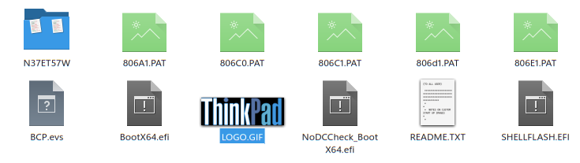

# Adding a custom boot logo to a ThinkPad
**WARNING: flashing the bios can be dangerous, if you do it wrong, you can brick your computer. so make sure you have a backup of your data, and that you know what you are doing.**

**Also the usb device you use to flash the bios will be completely wiped, all existing data is lost. selecting the wrong drive will also wipe that drive, so be careful!**

Source: https://blog.x4m3.rocks/thinkpad-custom-boot-logo/

I use this to add a custom Logo to my ThinkPad P15 Gen 2.

## ❯ I want to use the 25 year anniversary logo
https://archive.org/details/logo_20200118


The general approach is to download a bios update iso from lenovo, extract the iso, and replace the logo file with your own. Then you can flash the bios with the modified iso.

## ❯ get the bios update iso
https://support.lenovo.com/de/de/downloads/ds551321-bios-update-utility-bootable-cd-for-windows-10-64-bit-thinkpad-p15-gen-2-p17-gen-2-t15g-gen-2

In my case I downloaded the file ```n37ur22w.iso```, which is the latest bios 1.38 for my ThinkPad P15 Gen 2.

## ❯ convert the iso image
to use it with an usb stick you need to convert the iso image to a raw image.

### install geteltorito
```bash
sudo emerge --ask app-cdr/geteltorito 
```

### convert the iso to a raw image

```bash
geteltorito -o n37ur22w.img n37ur22w.iso
```
output:


## ❯ ⚠ flash the image on your usb drive
the usb drive will be completely wiped, all existing data is lost.
selecting the wrong drive will also wipe that drive, so be careful!

### find your usb drive
```bash
lsblk
```
output:


so in my case the usb drive is /dev/sda

### flash the image to the usb drive, replace /dev/sdX with your usb drive
```bash
sudo dd if=n37ur22w.img of=/dev/sdX bs=1M status=progress oflag=sync
```
output:


and now the usb drive was automatically mounted the content looks like this:


## ❯ select the logo file
check the README.TXT file to see the filenames, they might differ on different models.

put the image in the Flash folder, and name it accordingly. In my case LOGO.GIF, but it can also be LOGO.BMP or LOGO.JPG, depending on your filetype.


that's it, now its time to flash the bios.

## ❯ flash the BIOS update
*flashing the bios can be dangerous, if you do it wrong, you can brick your computer. so make sure you have a backup of your data, and that you know what you are doing.*

- reboot your computer, and boot on the usb flash drive. if you don't know how, the internet should help you with that.

- now that the flash utility has booted, choose the second option, and follow the instructions.

- the computer will reboot, flash the update, and when it will reboot, you should get your custom boot logo!

## ❯ removing the logo
if you want to go back to the default logo, simply reflash the bios update, when when asked if you want to use your custom logo, say no, and the default logo will be put back.

