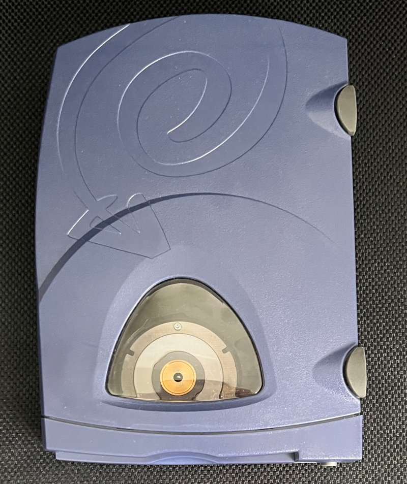
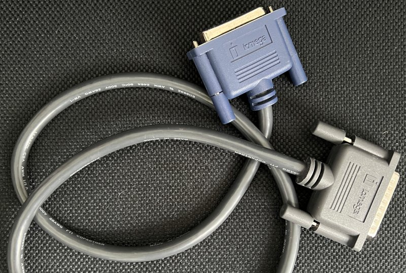
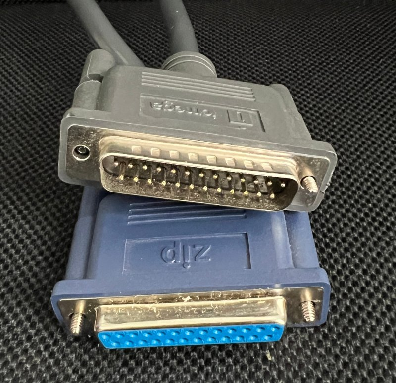
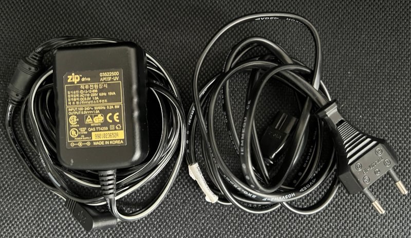
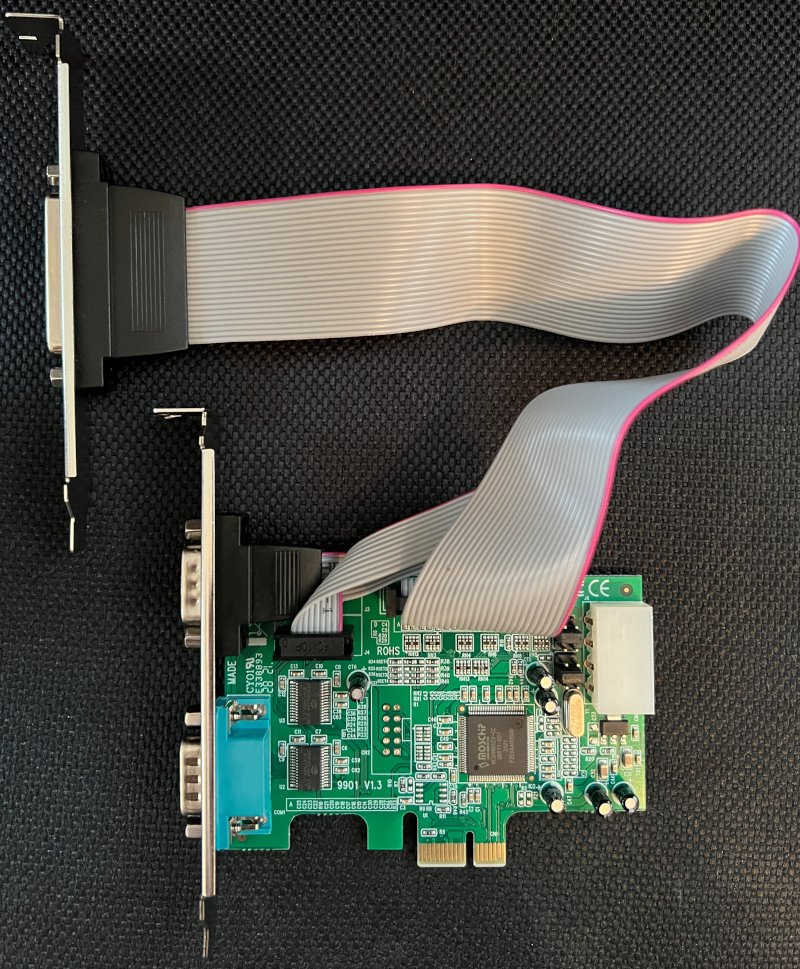
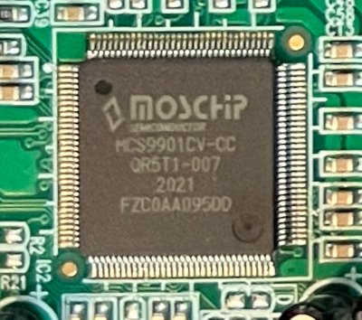
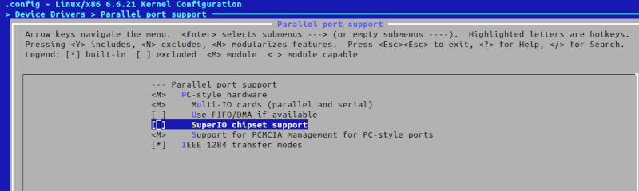
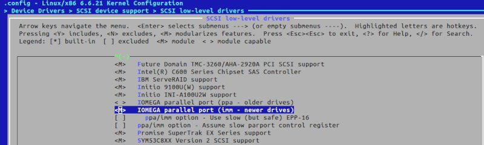

# Using a Parallel Port Iomege Zip Drive 250 with Linux (Kernel 6.6.21) on a modern PC (2024).

I wanted an old-fashioned way to transfer "bigger" chunks of data to a 386 class PC.

As the 386 and 486 machines do not have USB, I thought of Zip Disks. On the 386 side the parallel port was kind of an obivous choice. For the modern PC I initially wanted to use an USB Zip Drive (which I also have and it works without further setup on Linux and Macos. I have not tried Windows).

But then I asked myself would it be possible to use the parallel port zip drive on the modern PC as well? Short answer: Yes. Long answer below.

## The Hardware
you will need a parallel port zipdrive. (I got a 250MB version).

| Image                                                                                                                               | Description                                                                                                                                                                                                                                                                                                                 |
|-------------------------------------------------------------------------------------------------------------------------------------|-----------------------------------------------------------------------------------------------------------------------------------------------------------------------------------------------------------------------------------------------------------------------------------------------------------------------------|
|                                                                                                   | Zip Drive 250                                                                                                                                                                                                                                                                                                               |
| <br/>                                   | parallel port cable                                                                                                                                                                                                                                                                                                         |
|                                                                                                | Power Supply                                                                                                                                                                                                                                                                                                                |
|  </br>  | I used a "Startech 2S1P Native PCI Express Parallel Serial Combo Card with 16550 UART". It is important to choose the right Card or you will only get SPP Support or no Linux Support at all. After reading some CNC Forums I found out that the MOSCHIP MCS9901 is a good choice to get EPP support. This turned out true! | 


Install the card in your PC and connect the parallel port cable to the zip drive. Connect the power supply to the zip drive.
I used a free pcie x16 slot for the card. The card is recognized by the kernel and the parallel port is available.

Using this particular card with MCS9901 chipset I was able to use the EPP mode of the parallel port. This makes a tremendous difference in speed. In SPP mode hdparm -tT reports about 100kB/sec, in EPP mode it reports about 330kB/sec!

Another card using WCH382L chipset could only be used in SPP mode, despite the fact that the card was advertised as EPP capable.

## The Software

### getting the required kernel module
the parallel port zip drive relies on the `imm` kernel module (older versions rely on `ppa` module) These modules are not build by default on modern kernels.

I'm using Gentoo so adding a kernel module is quite easy. I simply added the needed part of the kernel config to a file: `/etc/kernel/config.d/10iomega.config` (create the directory if it does not exist)

```
CONFIG_SCSI_IMM=m
```

after that it is as simple as running `emerge -1 gentoo-kernel` to have the module available.

For other distributions steps might be different here are screenshots of the kernel config:


>Device Drivers > Parallel port support 




> Device Drivers > SCSI device support > SCSI low-level drivers



after theses modules are enabled, rebuild your kernel. maybe there are other ways to build the required parallel port and scsi modules.

### testing if everything works
 - when the kernel is build you can test the ZIP Drive. Open a Terminal and issue journalctl -f to see the kernel messages.
 - connect the zip drive to the parallel port and power it on
 - remove any disk from the zip drive (other documents suggest to insert a disk, for me it only works if the drive is empty)
 - load the module in another terminal as root with `modprobe imm` (most probably you need imm, if it does not work try ppa)

if everything is working you should see something like this in the journalctl output:

```
Jan 01 00:00:00 hostname kernel: imm: Found device at ID 6, Attempting to use EPP 32 bit
Jan 01 00:00:00 hostname kernel: imm: Communication established at 0x5010 with ID 6 using EPP 32 bit
Jan 01 00:00:00 hostname kernel: scsi host8: Iomega VPI2 (imm) interface
Jan 01 00:00:00 hostname kernel: scsi 8:0:6:0: Direct-Access     IOMEGA   ZIP 250          H.41 PQ: 0 ANSI: 2
Jan 01 00:00:00 hostname kernel: sd 8:0:6:0: Attached scsi generic sg2 type 0
Jan 01 00:00:00 hostname kernel: sd 8:0:6:0: Power-on or device reset occurred
Jan 01 00:00:00 hostname kernel: sd 8:0:6:0: Power-on or device reset occurred
Jan 01 00:00:00 hostname kernel: sd 8:0:6:0: [sdc] Media removed, stopped polling
Jan 01 00:00:00 hostname kernel: sd 8:0:6:0: [sdc] Attached SCSI removable disk
```
if you insert a zip disk you should see it as a scsi device. In my case it was `/dev/sdc` a zip disk usually uses the 4th partition, so the device you want to mount is `/dev/sdc4`

### mounting the zip disk
to mount the zip disk I added an entry to `/etc/fstab`:

```
/dev/sdc4                                   /media/zipdrive  vfat   noauto,rw,user     0 0
```

this allows the zip disk to be user mountable. the target directoy `/media/zipdrive` needs to be created. 
now a normal user will see the zip disk appear in the file manager and can mount it by clicking on it.

### convenient activation of the zip drive
[I created a small script](zipdrive.sh) to load the module for the zip drive. I placed it in `/usr/local/bin/zipdrive.sh`:

1. copy [this script](zipdrive.sh) to /usr/local/bin/zipdrive.sh
2. change the permissions to make it executable: `chmod 755 /usr/local/bin/zipdrive.sh`
3. change the owner to root: `chown root:root /usr/local/bin/zipdrive.sh`

<details>
<summary>Contents of zipdrive.sh</summary>

```bash
#!/bin/env bash

# This script is used to manage a ZIP Drive on a Linux system. It checks if the necessary module and tools
# are available, and then either activates or deactivates the ZIP Drive based on its current state.
# The user is prompted to take necessary actions before each operation.

# copy this script to /usr/local/bin/zipdrive.sh
# change the permissions to make it executable: chmod 755 /usr/local/bin/zipdrive.sh
# change the owner to root: chown root:root /usr/local/bin/zipdrive.sh

# newer zip drives require the imm module, older zip drives require the ppa module
MODULE_NAME="imm"

# Check if script is run as root
if [ "$EUID" -ne 0 ]
    then echo "Need root privileges to interact with kernel modules ..."
    sudo "$0" "$@"
    exit 0
fi

main() {
    # Sanity checks
    if ! check_module ; then
        echo "The module $MODULE_NAME does not exist. Can not activate Zip Drive. Please make the module available."
        exit 1
    fi

    if ! check_jq ; then
        echo "jq not found, please install jq package for your distribution."
        exit 1
    fi

    # Start / Stop Zip Drive
    if module_loaded; then
        module_deactivate
    else
        module_activate
    fi
}

check_jq() {
    which jq 2>/dev/null 1>&2
    return $?
}

check_module() {
    if [ ! -f "/usr/lib/modules/$(uname -r)/kernel/drivers/scsi/$MODULE_NAME.ko" ]; then
        return 1
    fi
    return 0
}

module_loaded() {
    lsmod | grep "$MODULE_NAME" &> /dev/null
}

module_activate() {
    prompt_user "Activating ZIP Drive. Please power on the ZIP Drive and remove any media from the drive."

    # Get the current timestamp
    TIMESTAMP=$(date +"%Y-%m-%d %H:%M:%S")

    modprobe $MODULE_NAME
    sleep 2

    # Display the system log output since the timestamp
    echo ""
    journalctl -k --since "$TIMESTAMP" -o json | jq -r 'select(.MESSAGE | test("'$MODULE_NAME'|scsi"; "i")) | .MESSAGE'
    echo ""
}

module_deactivate() {
    prompt_user "Deactivating ZIP Drive. Please ensure to unmount any ZIP Disks and remove them from the drive."
    modprobe -r $MODULE_NAME
}

prompt_user() {
    local message=$1
    echo "$message"
    echo "Press any key to continue..."
    read -n 1 -s
}

main "$@" || exit 1

```
</details>

now the procedure is the following:
1. power on the connected zip drive
2. run `zipdrive.sh`
3. follow the instructions
4. the zip drive should be available in the file manager. disks can be mounted and unmounted or swapped as usual
5. to deactivate the zip drive umount and remove any disk, run `zipdrive.sh` again


### Interesting Commands

#### ejecting the zip disk, like a cdrom in the good old days
```bash
# if the zip disk is unmounted you can even use eject to eject the disk :P
eject /dev/sdc
```

#### checking disks for bad sectors (destroys data)
BEWARE THIS WILL DESTROY ALL DATA ON THE DISK. USE WITH CAUTION, VERIFY THE DEVICE NAME BEFORE RUNNING THE COMMAND

(taken from https://wiki.archlinux.org/title/badblocks)
1. Span a crypto layer above the device: ```cryptsetup open /dev/sdc zipdisk --type plain --cipher aes-xts-plain64```
2. Fill the now opened decrypted layer with zeroes, which get written as encrypted data: ```shred -v -n 0 -z /dev/mapper/zipdisk```
3. Compare fresh zeroes with the decrypted layer: ```cmp -b /dev/zero /dev/mapper/zipdisk``` 
4. If it just stops with a message about end of file, the drive is fine. 

This method is also way faster than badblocks even with a single pass. As the command does a full write, any bad sectors (as known to the disk controller) should also be eliminated.

#### repartition and format a zip disk as fat16 (works for 100 and 250 MB disks)
BEWARE THIS WILL DESTROY ALL DATA ON THE DISK. USE WITH CAUTION, VERIFY THE DEVICE NAME BEFORE RUNNING THE COMMAND
```bash
# destroy partition table (and wipe vfat signature at beginning of partition4)
sudo dd if=/dev/zero of=/dev/sdc bs=1M count=1
# recreate a partition table on the zip disk
echo -e "o\nw" | sudo fdisk --compatibility=dos /dev/sdc

# create partition number 4 marked as fat16
# n creates a new partition.
# p specifies it as a primary partition.
# 4 sets it as the 4th partition.
# The two \n characters accept the default values for the first and last sectors, using all available space.
# t changes a partition's system id.
# 6 sets the type to FAT16.
# w writes the changes and exits.
echo -e "n\np\n4\n\n\nt\n6\nw" | sudo fdisk --compatibility=dos /dev/sdc

# formating a zip disk as fat 16, the -n option sets the label
sudo mkfs.vfat -F 16 /dev/sdc4 -n ZIPDISK


```
